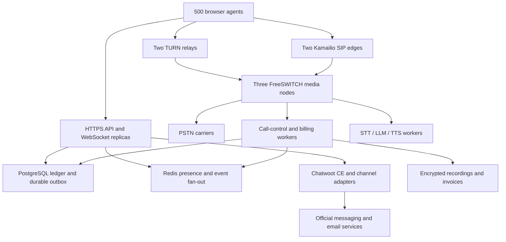

# Omni500 — production architecture and engineering boundaries

## Decision and acceptance scope

Target: 500 simultaneously registered and working agents. The capacity test MUST also
exercise 500 concurrent bridged conversations, 1,000 base call legs plus transient
consultation, supervisor and bot legs. Headcount alone does not specify media load.
This repository is a reference implementation and production deployment design, not
a certified turnkey contact center. Its billing calculator and softphone are implemented;
multiple integrations below remain to be built. Nothing has been deployed to a carrier.

Zero proprietary software license fees is achievable with a reviewed component selection.
“License-free” is not: open-source licenses apply. PSTN numbers, trunk minutes, WhatsApp,
SMS, compute, GPUs, network transit, storage and operations may cost money. Meta services
are proprietary external APIs even when the connector is open source. There is no
self-hosted equivalent of the official WhatsApp network. Do not use unofficial WhatsApp
Web automation as a production replacement.

## Topology

FreeSWITCH terminates the browser DTLS-SRTP/ICE media leg and bridges to a separately
negotiated carrier leg. Kamailio proxies SIP signalling only. Coturn relays encrypted
packets and does not transcode or perform SIP routing. No RTPengine is required if all
media is anchored at FreeSWITCH. Introducing media bypass would change that design.
Use Opus on browser legs, PCMA/PCMU where carriers require it. Transcoding adds CPU and
latency. Do not demand Opus from a G.711-only trunk.

## Candidate sizing — engineering assumptions, not benchmark results

| Tier | Initial placement | Redundancy / admission target |
|---|---|---|
| SIP/WSS | 2 × 4 vCPU, 8 GiB | Each handles all 500 registrations and reconnect burst |
| FreeSWITCH | 3 × 16 dedicated vCPU, 32 GiB | Benchmark each at ≥250 bridged conversations; 2 survive a node loss |
| TURN | 2 × 4 vCPU, 8 GiB, 1 Gbps NIC | Each sized for all relay traffic; quota and connection limits tested |
| API/WS/control | 3 × 4–8 vCPU, 8–16 GiB | Stateless APIs; one fenced owner per switch event stream |
| PostgreSQL | 3 × 8 vCPU, 32 GiB + mirrored NVMe | Primary, synchronous standby, extra replica with quorum controller |
| Redis | 3 data nodes + 3 Sentinel voters | Primary/replica topology; separate Chatwoot workload if contention |
| AI | Separate GPU pool | Benchmark model, language, stream concurrency and first-audio SLO |
| Storage | S3-compatible object store | Separate failure domain, encryption, retention, restore tests |

No per-server call capacity is guaranteed. Measure codec mix, recording, conferencing,
transcription fan-out, CPS, CPU steal and actual hardware. N+1 protects new-call capacity;
FreeSWITCH is a B2BUA with node-local live RTP state. A failed media node drops its active
calls. Redis does not migrate those sessions. Kamailio edge failure also drops WSS
connections on that edge; browsers reconnect and re-register. Do not promise zero-drop HA.

At 500 calls and a 300-second average answered duration the steady average is ~1.67 calls/s.
Test 20 CPS bursts plus 500-agent simultaneous re-registration. Warm transfers can double
agent-side legs temporarily. Cap admissions based on actual media legs, CPU and licensed
carrier channels (if applicable), not just number of users.

For a planning G.711 estimate, budget ~100 kbit/s per one-way RTP stream with overhead.
A bridged call has four one-way streams at the media server: ~400 kbit/s aggregate I/O.
500 calls are ~200 Mbit/s combined RX+TX before redundancy, TURN overhead and headroom.
A TURN-relayed browser leg crosses the relay twice per direction. Measure real packets;
reserve at least 2× calculated bandwidth and include cloud egress cost.
Stereo PCM at 8 kHz / 16-bit is ~115.2 MB per call-hour: 500 continuously recorded agents
for 8 hours is ~460.8 GB/day before compression and replication. Retention is a sizing input.

## Latency SLO

Target one-way mouth-to-ear audio P95 <200 ms within the supported regional network envelope.
Illustrative budget: packetization 20 ms + codec 10 ms + jitter buffer 30 ms + access/WAN
60 ms + media/relay processing 15 ms = 135 ms, leaving 65 ms headroom. This is a budget,
not a measured result. Cross-continent paths, overloaded Wi-Fi and TURN/TCP head-of-line
blocking can exceed it. Supply UDP TURN plus TLS TURN fallback, geographically close
relays, DSCP where respected and 20 ms packetization. TURN improves connectivity, not
latency guarantees. Test mouth-to-ear with injected markers and packet capture. RTCP RTT
alone is not a mouth-to-ear measurement. Bot response latency is a separate SLO, initially
P95 <1.5 seconds to first audio after endpointing, subject to model benchmarks.

## Authority and events

- PostgreSQL owns balances, reservations, rate versions, CDRs, conversations, audit and invoices.
- Redis Pub/Sub owns no authoritative financial state. It provides live UI hints and presence
  fan-out. Clients refetch snapshots after reconnect or a sequence gap.
- Durable commands use a PostgreSQL outbox written in the same transaction as the state
  change, then Redis Streams consumer groups or a PostgreSQL job worker. At-least-once
  delivery requires a unique event ID and idempotent processing. Do not say “exactly once.”
- One fenced call-control owner per FreeSWITCH node ingests ESL events. Persist events and
  sequence/checkpoint before acknowledgement where the source supports acknowledgement.
  ESL itself is not a durable event source: also spool final CDRs locally for reconciliation.
- Rate snapshots are bound at authorization and never changed by a rate-card import mid-call.
- Redis outages degrade presence and dashboards. They do not grant free calls. Billing/control
  failures deny new paid calls and let existing calls expire at local authorization deadlines.

## Authentication, tenant isolation and RBAC

Use an open-source OIDC provider such as Keycloak. Server validates issuer, audience,
signature, expiry and tenant claim. Application role is read from the database instead
of trusting a role supplied by the browser. Tokens have short lifetimes. MFA applies to
supervisor and administrator roles. Browser SIP credentials are separately scoped and
short-lived; do not embed a trunk or ESL password in the frontend.

Every tenant table has an explicit tenant ID and RLS policy. API transactions use SET LOCAL,
never persistent connection-level tenant state. Runtime DB roles are neither table owners
nor superusers and lack BYPASSRLS. Composite FKs prevent cross-tenant relationships.
Migration ownership and runtime roles are separate. Connector secrets are not readable by
the general API role. AES-256-GCM secret envelopes use a unique random nonce, tenant/channel
AAD and a versioned key reference held outside the DB. Rotate keys without logging values.

| Role | Intended permissions |
|---|---|
| Super Admin | Platform provisioning through explicit audited tenant context |
| Tenant Administrator | Tenant users, channels, queues, tariffs, wallets and configuration |
| Queue Manager | Assigned queues, wallboards and authorized monitor/whisper/barge commands |
| Billing Auditor | Read tariffs, CDR financial fields, ledger and invoices; no call control |
| Agent | Assigned conversations, own calls, presence and explicitly scoped balance summary |

Queue-scoped permissions require QueueMember / supervisor scope grants, not just a role
check. The included API has no supervisor execution endpoint. Control actions require
actor, tenant, queue membership, active call ownership, reason, consent policy and audit
write before dispatch. Browser-supplied UUIDs are never passed straight to ESL.

## Prepaid, postpaid and LCR

1. Authenticate agent/trunk and derive tenant from trusted registrar data. Validate E.164
   number, allowed country/premium prefixes, caller ID and account permissions.
2. Snapshot SELL card and each healthy COST card. Longest-prefix match within each carrier.
   Filter capacity, allowed region, quality, currency and availability. Compare expected
   total cost at a configurable planning duration (default 180 s), including connect fee
   and billing increments. Lowest per-minute alone is not sufficient. Deterministic ties.
3. Atomically reserve the setup fee plus initial block using a locked wallet row. For
   parallel calls all reservations share that lock. Available = balance + creditLimit − reserved.
4. Only after successful authorization originate the B leg. Install a local switch deadline
   before it can consume paid media. Start rating at the billable answer event, not ringback.
   Cancelled/unanswered attempts release funds only after proving the call is no longer live.
5. Before each next block extend the cumulative reservation and renew the switch deadline.
   Lease renewal must cover both financial reservation and the switch update. If either
   fails retain the reservation and kill/expire the call; do not release spendable money early.
6. At final hangup compute cost and sell independently from their snapshots. In the same
   transaction settle the reservation, insert immutable debit, finalize CDR and emit outbox.
   Repeated hangup/CDR events return the prior result. Conflicting totals are quarantined.
7. Compare local final CDR spool, billing events and ledger daily. Late carrier adjustments
   produce explicit adjustment entries, never silent edits to settled calls.

An exact wall-clock disconnect at zero is impossible on a distributed system. Stop before
unfunded usage by reserving increments and scheduling a conservative switch-local cutoff.
Account for signalling/scheduling jitter; define a bounded operator exposure, never silently
make the wallet negative. FreeSWITCH scheduler granularity and CGRateS debit interval must
be measured; millisecond duration arithmetic does not imply millisecond hangup precision.

ASTPP and the included ledger MUST NOT both debit the same call. Choose one authority.
The supplied wallet functions form the custom-reference mode. ASTPP mode requires a tested
adapter and read-only balance projection. CGRateS can alternatively own session debits.
The Python calculator is an oracle/preview in those modes until parity is demonstrated.

## IVR and queue routing

Flow editor: React Flow-compatible JSON, immutable versions, draft validation and publish.
Nodes: start, prompt, dtmf, hours, holiday, skills, queue, callback, bot, webhook, transfer,
hangup. Edges include timeout, no-match and error. Validate reachability, bounded cycles,
asset existence, DTMF uniqueness, number allowlist and webhook destinations before publish.
Compile to versioned FreeSWITCH XML/Lua actions. Never evaluate arbitrary user Lua/JS.
Keep the previous compiled version for rollback and active-call consistency.

Use IANA tenant timezones. Holiday overrides precede business hours; explicitly test
midnight, overnight shifts and DST for tenants outside Malaysia. ACD claims agent slots
atomically in PostgreSQL/Redis Lua with fenced leases: AVAILABLE alone is not enough.
Match required language and minimum proficiency, then queue priority and longest-idle.
FreeSWITCH mod_callcenter queues are node-local unless deliberately coordinated; do not
create independent copies and assume a shared global queue. A custom routing coordinator
must reserve an agent before originating on the node that owns the waiting call.

Queue position reflects eligible callers in that queue, not globally across priorities.
Estimated wait uses recent service-rate distribution and staffing; label it an estimate.
Announcements every configurable 30–60 seconds, interrupted when an agent is reserved.
MOH assets must have redistribution/playback rights. SLA example: answered within 20 s /
(offered − policy-defined short abandons); publish the exact short-abandon rule alongside
results. Average wait for answered calls and current queued age are different metrics.

Callback: store original queue timestamp and skills before ending the live caller leg.
The virtual ticket keeps its original ordering subject to eligibility. Claim with lease,
reserve an agent, dial customer with consent and permitted calling windows, bridge only
on answer. Retry boundedly (e.g. 3 attempts) and restore/release slot on failure. Do not
promise an exact position when queues have priorities, skills or newly unavailable staff.

## AI voicebot and chatbot

Media adapter emits tenant-scoped PCM frames with session ID, monotonically increasing
sequence and capture timestamps. Use an audited bidirectional media module or a SIP bot
endpoint. Do not assume a similarly named FreeSWITCH WebSocket/audio module supports
return audio, is installed by default or has the desired license. This adapter is not
included. Resample to the selected STT format, commonly 16 kHz mono PCM. Faster-Whisper
is not intrinsically a complete full-duplex streaming voicebot: add VAD, chunking,
endpointing, overlap removal and partial/final transcript handling.

On VAD speech start cancel the active TTS generation ID, flush queued playback and send
break to the media player. Keep inbound capture running. Ignore late chunks with the old
generation ID. Apply echo suppression and minimum speech duration to prevent self-barge-in.
Bot tools are allowlisted and tenant scoped; never allow an LLM to invent a routing number
or execute ESL directly. Retrieve only tenant-approved FAQ documents. Calibrate intent
confidence with labelled utterances; do not use LLM self-reported probability as truth.

Escalate on explicit human request, two unresolved turns, tool failure or calibrated
confidence < threshold. Persist transcript, language, intent, summary and tool results.
Stop bot output, enqueue the original customer leg, attach conversation ID to the human
assignment and continue MOH. The customer stays connected. If queues are closed, offer a
consented callback. Define a no-agent timeout. AI pool saturation must route to humans
rather than reject already answered calls.

## Channels and the unified inbox

Chatwoot CE provides conversation infrastructure and supported channel integrations.
The custom workspace uses a server-side Chatwoot adapter with per-tenant account mapping;
never expose a Chatwoot administrator API token to browsers. A single pane combining
voice, Chatwoot conversations and scoped supervision is an additional UI/API project,
not enabled merely by running Chatwoot beside this softphone.

All webhook handlers verify signatures over raw request bytes before parsing. Resolve
provider account -> tenant in trusted configuration. Uniqueness is (tenant, provider,
provider event ID). Store event and outbox before returning 2xx, then normalize asynchronously.
Retry with exponential backoff and a dead-letter queue. Outbound send uses idempotency,
per-provider throttles and provider message IDs. Scan attachments and restrict downloads
to permitted provider hosts to prevent SSRF. Store attachment metadata and encrypted objects.

| Channel | Required integration work / credentials |
|---|---|
| Web chat | Chatwoot widget, signed contact identity where available, domain allowlist |
| WhatsApp | Official Cloud API business assets, number, token, app secret, webhook verification, approved templates |
| Messenger | Meta app, page token, webhook subscriptions and required app review |
| Instagram | Eligible account/app setup and permissions for chosen Meta login integration |
| Telegram | Bot token, webhook secret token validation and chat ID binding |
| SMS | Chosen carrier/provider API, delivery receipts and sender authorization |
| Email | OAuth/IMAP or inbound-mail transport, SMTP outbound, Message-ID/In-Reply-To threading |

Respect provider policy windows and template status. Email parsing needs MIME handling,
attachment limits, loop detection, bounce processing and spoofing context (SPF/DKIM/DMARC).
A hosted service can charge even when its connector code is open source.

## Supervision, recordings and invoices

Monitoring is mediated by a call-control worker tied to the switch that owns the call.
For approved FreeSWITCH configurations use eavesdrop/conference controls, with separate
agent/customer legs. Whisper must reach only the agent; prove this with two recorded
endpoints before release. Barge adds a third participant. Termination targets an owned
call UUID. Require a reason, supervisor queue scope and an append-only audit event.
No generic `/esl?command=...` endpoint is permitted.

Record after the required notice/consent gate. Separate channels simplify agent/customer
transcripts. Encrypt local disks/spool and upload encrypted objects with per-tenant key
policy. Avoid unrestricted public object URLs. Grant short-lived signed downloads only
after RBAC checks and audit. Waveform peaks are generated asynchronously; transcript
segments carry offsets, speaker and confidence. Pause/redact payment-sensitive segments.
Retention, legal holds, deletion jobs and restore procedures are tenant policy inputs.

Invoice scheduler claims (tenant, account, period) idempotently, in tenant local billing
time. Select finalized uninvoiced CDRs at a stable cutoff, snapshot tax rules and company
identity, aggregate exact decimal values, round to currency minor units at the documented
stage and render PDF. Store object hash and immutable invoice lines. Late CDRs enter the
next period or a credit/debit note. No tax percentages are guessed from geography: finance
configures effective-dated regional rules. Implement jurisdiction-specific tax/e-invoicing
requirements separately. Included tax arithmetic is a calculator, not a tax compliance engine.
